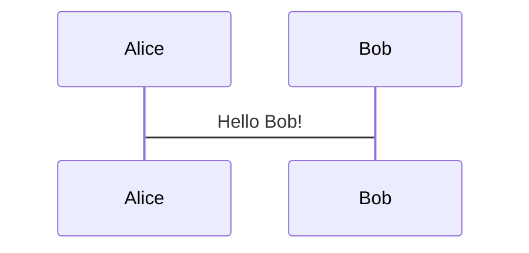
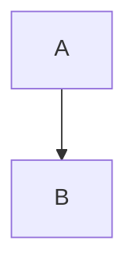

# Heading Level 1

## Heading Level 2

### Heading Level 3

#### Heading Level 4

##### Heading Level 5

###### Heading Level 6

---

**Bold Text Example**

*Italic Text Example*

~~Strikethrough Text Example~~

`Inline Code Example`

[1]: This is a footnote example.

==Highlighted Text Example==

<p>This is custom HTML content.</p>

```go
fmt.Println("Hello, Go!")
```

- Item 1

- Item 2

- Item 3

1. First

2. Second

3. Third

[Go to Google](https://www.google.com)


> This is a blockquote example.

<sub>Subscript Example</sub>

<sup>Superscript Example</sup>

Term 1
: Definition for Term 1

Term 2
: Definition for Term 2

- [Heading Level 1](#heading-level-1)

- [Heading Level 2](#heading-level-2)

- [Heading Level 3](#heading-level-3)

Header 1 | Header 2

--- | --- | 

Row 1, Col 1 | Row 1, Col 2

Row 2, Col 1 | Row 2, Col 2

- [x] Task 1

- [ ] Task 2

> **Note**: This is a note alert.

> **Warning**: This is a warning alert.

> **Danger**: This is a danger alert.






```math
E = mc^2
```

$a^2 + b^2 = c^2$

